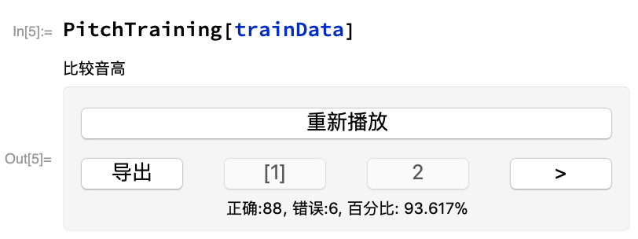
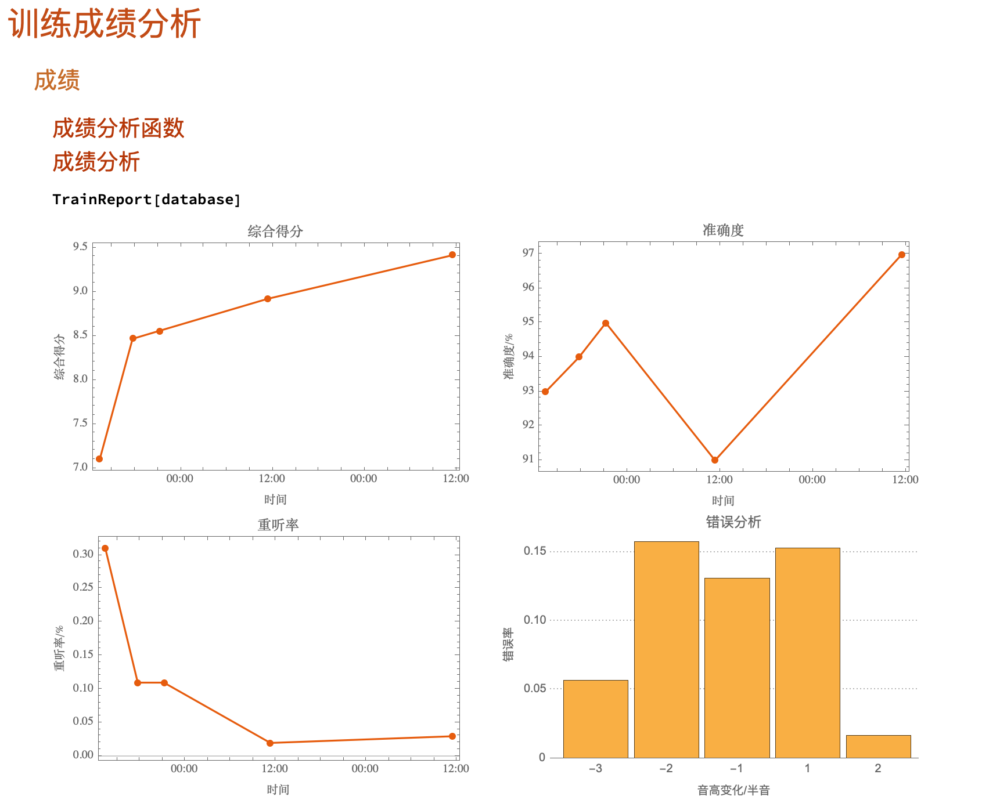
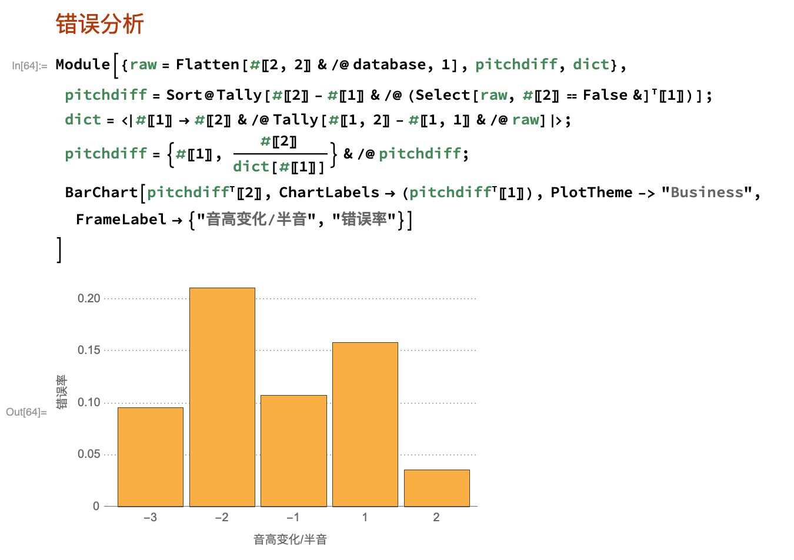

# 基础乐理练习

## 为什么做这个？

最近自己在学乐理（几乎零基础），用的是Bruce Benward的《认识乐理》。书里有练习题，但明显不够，所以就写了这个，辅助练习。

## 有哪些功能？

目前自己只学到第一章（逃……）

所以只有分辨音高大小的练习，但是后面章节的练习会陆续加上来（取决于我的学习进度）

### 练习：

运行`PitchTaining[trainData]`之后，就会开始音高练习，选择最高的那个音（1或者2，代表第一个、第二个）。

答对了会直接开始下一个；打错了会显示正确的，可以重新播放。然后点击`>`就可以开始下一个。

点击`导出`，就可以把训练信息导出到`trainData`中（非常重要，因为可以查看训练进度）。

### 学习进度：

运行`数据`中的代码之后，在运行准确度、重听率，就可以看到训练的进度。

这里还提供错误分析功能：

可以显示不同问题的出错率，从而有针对性的学习。

## TODO：

* 自动根据出错率出题